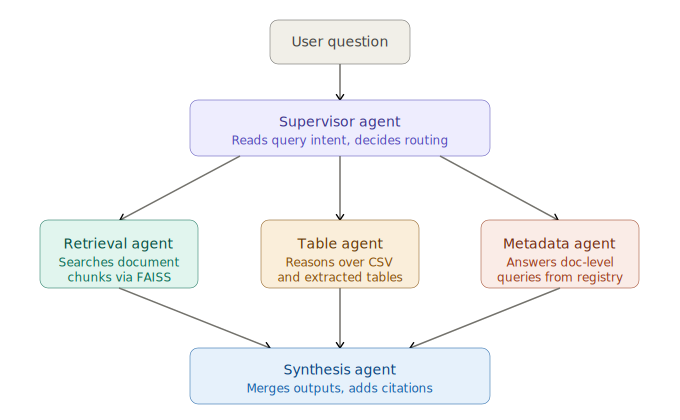

## Doclyst

## Background

This project grew out of my M.Sc. thesis at masem Research Institute, where I built a supervisor-based multi-agent system for offline LLM deployment under strict data governance constraints. 

Doclyst is a cleaner, more generalised version of that work, with a proper ingestion pipeline, a Streamlit frontend, and the offline-first design preserved through the Ollama option.

The manufacturing domain was a natural fit. I had hands-on experience with sensor data and maintenance reporting through coursework and project work at masem.

Thisproject is a multi-agent RAG system for querying manufacturing documents.

These documents could be maintenance reports, sensor logs, operational PDFs, through a conversational interface.

Built with LangGraph, FAISS, and Streamlit. 

The LLM backend is switchable between Claude and a local Ollama model via a single environment variable, which made sense given the data-sensitivity constraints.


## How this works?




1. The supervisor classifies each query and activates one or more specialist agents. 
2. For complex questions it runs retrieval and table agents in parallel, then passes both outputs to synthesis. 
3. The agent trace is visible in the Streamlit sidebar, which is mostly useful for demos and for debugging.


## Project structure

```
Doclyst-rag-based-agents/
├── agents/
│   ├── supervisor.py         # LangGraph graph + routing logic
│   ├── retrieval_agent.py    # dense retrieval over FAISS/ChromaDB
│   ├── table_agent.py        # pandas + LLM over extracted tables
│   ├── metadata_agent.py     # document registry queries
│   └── synthesis_agent.py    # answer fusion and citations
├── core/
│   ├── llm_factory.py        # switchable LLM backend
│   ├── vectorstore.py        # FAISS and ChromaDB abstraction
│   ├── document_loader.py    # PDF, DOCX, CSV, TXT ingestion
│   └── config.py             # env-based config
├── data/sample_docs/         # synthetic Q3 2024 maintenance data
├── frontend/app.py           # Streamlit UI
├── scripts/ingest_documents.py
├── tests/test_agents.py      # unit tests with mocked LLM
└── .github/workflows/ci.yml  # lint + test + Docker build on push
```


## Technology Stack

| | |
|---|---|
| Orchestration | LangGraph |
| LLM | Claude API or Ollama (Mistral / Llama) |
| Embeddings | `sentence-transformers` (HuggingFace) |
| Vector store | FAISS (default) / ChromaDB |
| Document parsing | `pdfplumber`, `python-docx`, `pandas` |
| Frontend | Streamlit |
| CI/CD | GitHub Actions (lint → test → Docker build) |
| Deployment | Docker + Docker Compose |


## LLM configuration

Two backends, one env variable:

```env
# Cloud, here we require Anthropic API key
LLM_PROVIDER=claude
ANTHROPIC_API_KEY= ""

# Local, requires Ollama running
LLM_PROVIDER=ollama
OLLAMA_MODEL=mistral 
```
The factory in `core/llm_factory.py` handles both.